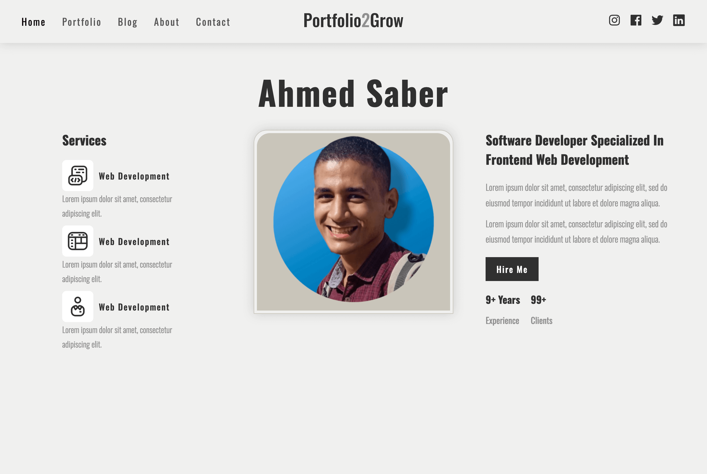

# intern2Grow-ui-developer-personal-portfolio

### Summary of Portfolio Project

[View Demo](https://github.com/billalben)

[Link Figma Design](https://www.figma.com/design/n2RPnDQSd7yMM8qFh3T1Th/Intern2Grow---UI-Developer---Personal-Portfolio?node-id=1-17&t=S5RDwWTAMhtFF3hH-1)

**Project Overview:**
- **Task:** Build a simple portfolio website.
- **Source of Design:** Figma.
- **Duration:** Couple hours.
- **Tools & Technologies Used:** HTML, CSS, JavaScript, Figma.

**Process:**
1. **Design Analysis:**
   - Reviewed and analyzed the Figma design to understand the layout, color scheme, typography, and overall aesthetics.

2. **Setup & Structure:**
   - Set up the project directory structure, including folders for HTML, CSS, JavaScript, and assets.
   - Created a responsive layout using HTML and CSS, ensuring compatibility across different devices and screen sizes.

3. **Development:**
   - Implemented the header, navigation, and hero sections as per the Figma design.

4. **Styling & Responsiveness:**
   - Used media queries to ensure the site is fully responsive, providing a seamless user experience on mobile devices.

5. **Testing & Deployment:**
   - Conducted thorough testing to identify and fix any bugs or design inconsistencies.
   - Deployed the portfolio website to a web server for live access.

**Outcome:**
- Successfully built a fully functional and visually appealing portfolio website.
- Gained valuable experience in translating Figma designs into a live website.
- Improved skills in HTML, CSS, and JavaScript, as well as responsive web design principles.

**Key Learnings:**
- The importance of planning and design analysis before starting development.
- Effective use of Figma for extracting design elements and ensuring design fidelity.
- Techniques for making a website responsive and user-friendly across different devices.
